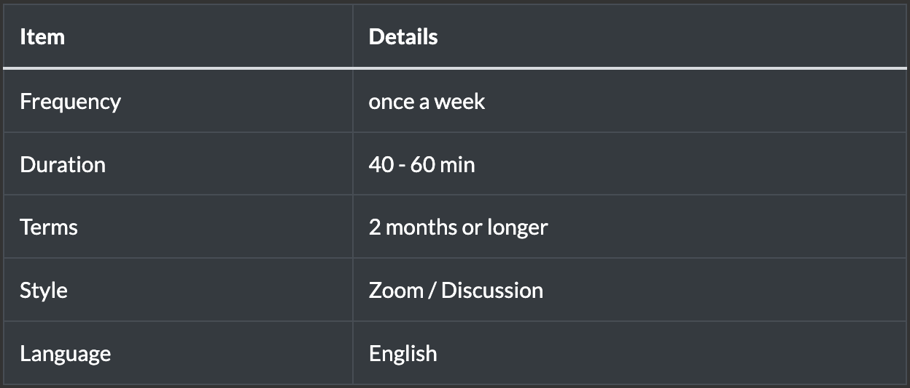
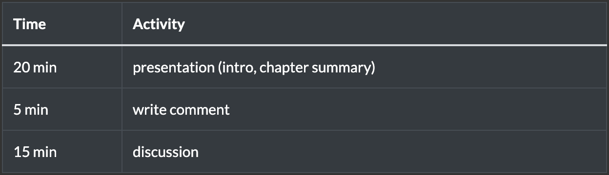
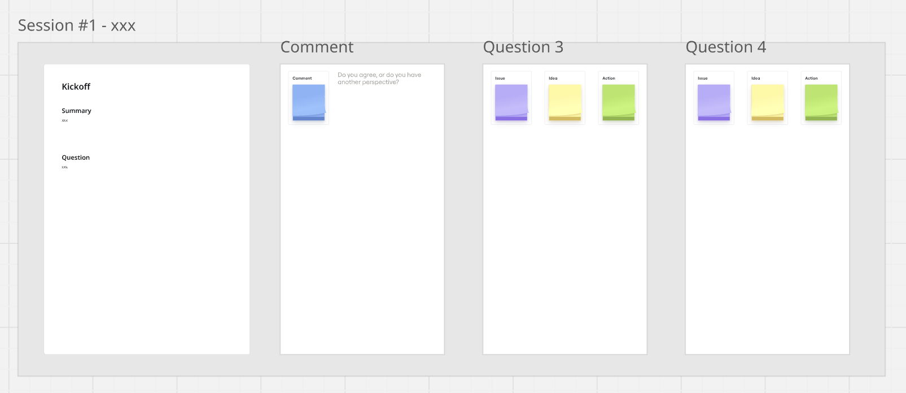
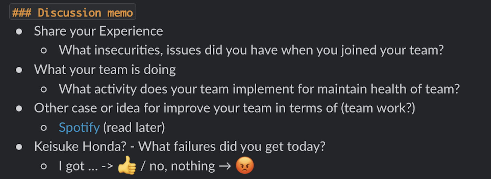
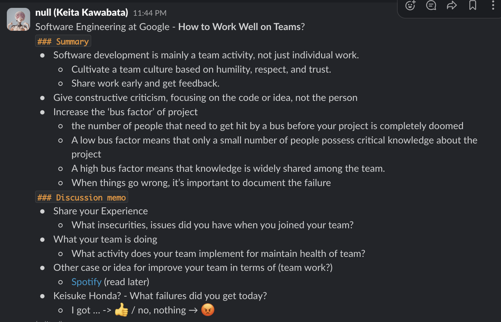
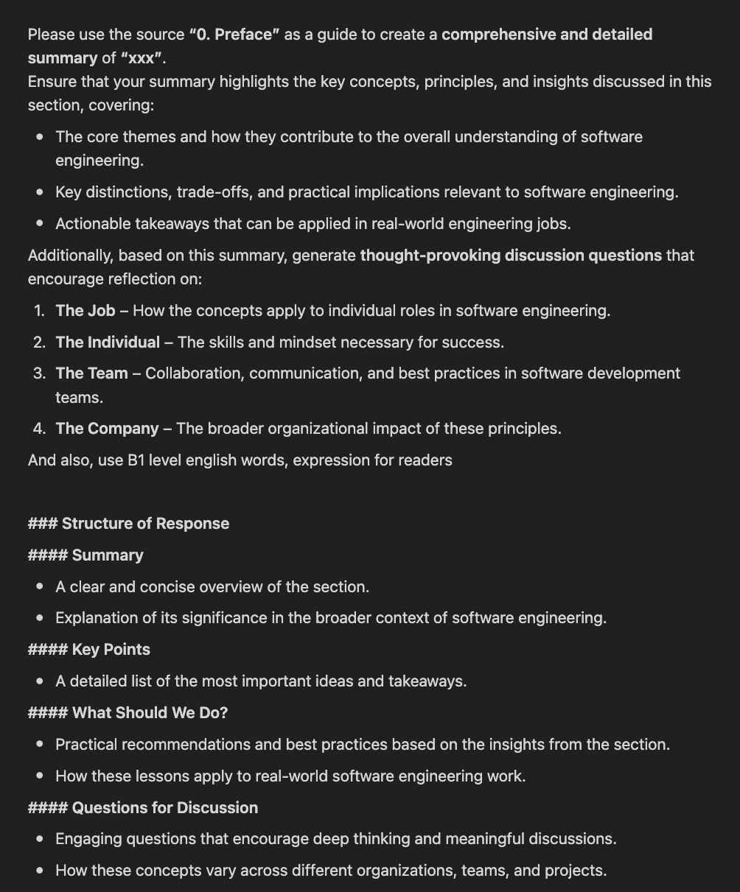
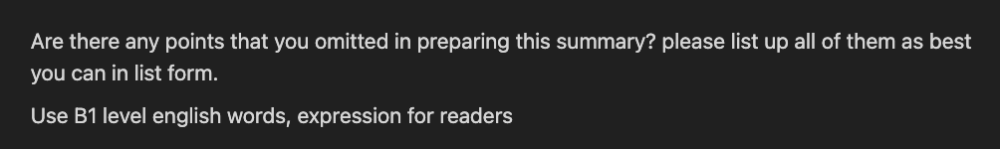

### 2025/03/18

# Kickoff

### Keita Kawabata

<!--
_class: title
 -->

---

# Agenda

1. About reading group
2. About "Software Engineering at Google"
3. How to read books with AI

<!--
_class: list
 -->

---

# About reading group

---

# Purpose

- Provide an opportunity to discuss your growth and the team's growth.
- Apply what you learn from this book to your work or team.

<!--
_class: list
 -->

---

# Outline

**You can find all information about this reading group on Slack (Canvas).**

---

# Agenda for study group

- Presentation
  - We plan to have **rotating presentations**, **Use Miro**
- Comment & Discussion -> **Use Miro**

---

# Miro

Miro is an online whiteboard app for collaboration and brainstorming.

---

# Miro - How to Use

You can access it from Slack (Canva).

- **Summary**: Session summary provided by the **presenter**.
- **Comment**:
  - Comments on the summary.
- Question:
  - **Comment / Issue**: Comments or issues related to each question.
  - **Idea**: Ideas for solving the issues.
  - **Action**: Actions to implement the ideas.

---

# Example Topics for Discussion

---

# Ways to Engage in a Reading Group

1. Active Participation
2. Listening-Only Participation
3. Asynchronous Participation

<!--
_class: list
 -->

---

# Active Participation

## Join the live Discussion!

- The discussion topics are designed to help you grow, improve your team, and enhance GAOGAO.
- Don't Be Afraid to Speak English!

---

# Listening-Only Participation

## Write comment to Miro!

- Your comment makes our discussion smoother, more active, and higher quality.
- Just being there makes it easier to talk!

---

# Asynchronous Participation

## Share your thoughts and experience to Miro!

- Join our group on Slack: **#study_google_swe**
- I share the summary and question for each topic weekly
- You can add your thoughts and experience anytime in Miro

---

---

# About "Software Engineering at Google"

---

# What we can learn

1. **Core Principles of Sustainable Software Engineering:**
   Emphasis on long-term code value, scalability, and decision-making trade-offs.

2. **Google's Approach to Large-Scale Software Development**
   Insights into culture, engineering processes, and tooling strategies.

3. **Practical Methods**
   Lessons from Google's successes and failures, adaptable insights for other organisations.

---

# How to read books with AI

---

# NotebookLM

This is my original method. If you know a better way, please share!

1. Signup for NotebookLM
2. Add resources with url as website.
3. Generate Summary & Ask uncrear points

---

# Prompt #1

### For making summary

You are available in our group on Slack (Canvas)

---

# Prompt #2

### For find omitted point in preparing summary

---

# Thank you!

