### 2025/01/16

# TS Challenge - 1

### Keita Kawabata

<!--
_class: title
 -->

---

# Problem 1

<!--
_class: lead
 -->

---

## Let's define a `MyReadonly` type!

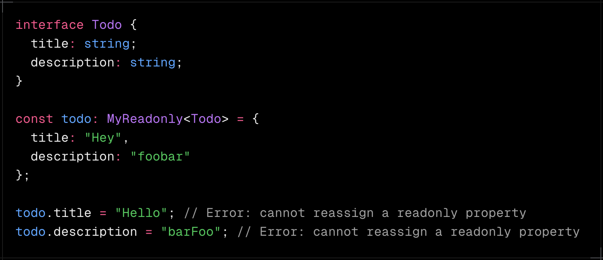

---

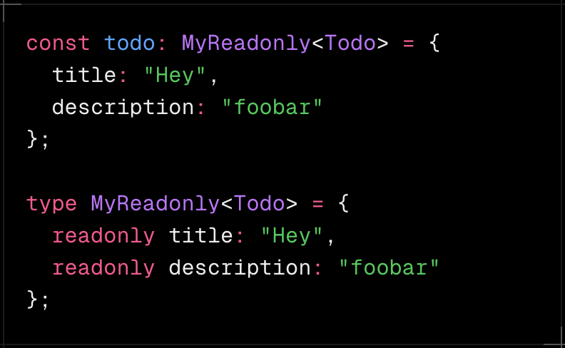

---

## Solution

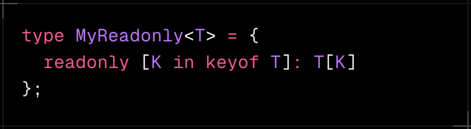

---

# Prerequisites

1. Generics
2. keyof operator
3. Mapped Types
4. index access types

<!--
_class: prereq
 -->

---

# Prerequisites

1. Generics
2. keyof operator
3. Mapped Types
4. index access types

<!--
_class: prereq
 -->

---

## Generics - Basic

#### A way to create reusable code that works with multiple types

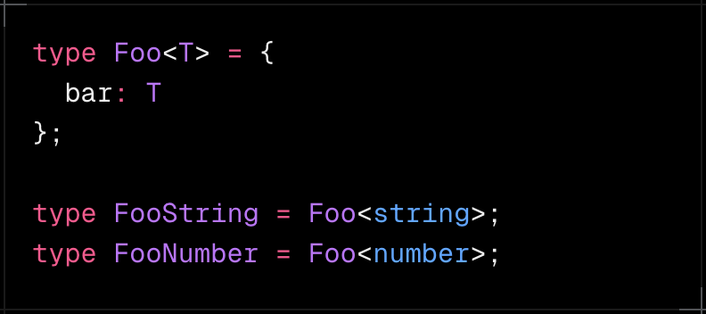

---

## Generics - Extends

#### Extends allows you to limit a generic type to a specific type

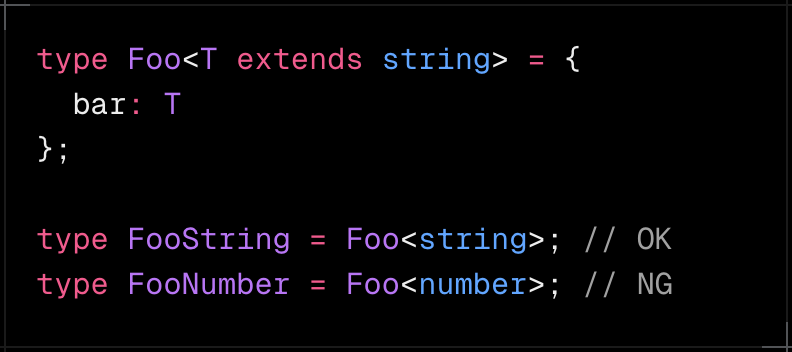

---

# Prerequisites

1. Generics
2. keyof operator
3. Mapped Types
4. index access types

<!--
_class: prereq
 -->

---

## keyof

#### A method to get object keys as a union type

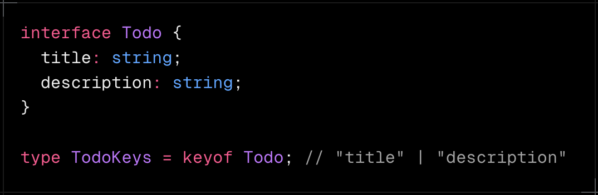

---

# Prerequisites

1. Generics
2. keyof operator
3. Mapped Types
4. index access types

<!--
_class: prereq
 -->

---

## Mapped Types

#### Can create a new object type based on a union of keys

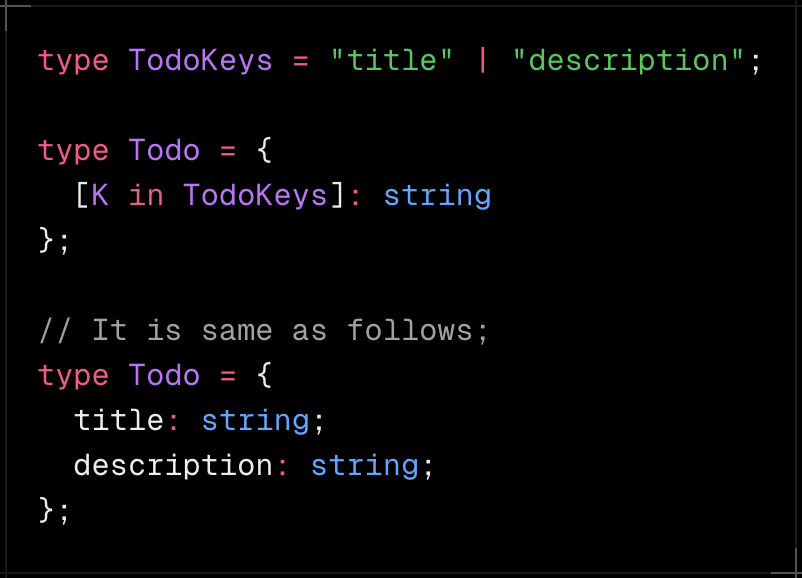

<!--
_class: split
 -->

---

## Mapped Types

#### with keyof operator

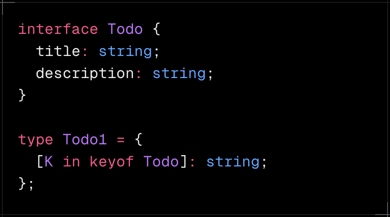

---

# Prerequisites

1. Generics
2. keyof operator
3. Mapped Types
4. index access types

<!--
_class: prereq
 -->

---

## index access types

#### Can get the type of a specific key in object

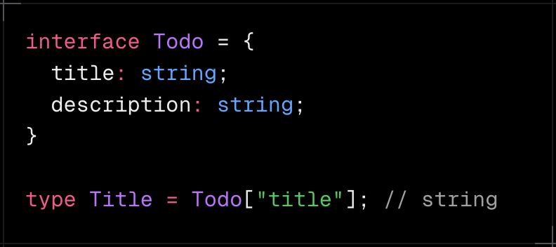

---

## Let's define a `MyReadonly` type!

---

## Solution

<!--
_class: lead
 -->

---

# Related Probelms - ①

<!--
_class: lead
 -->

---

### Implement a generic `MyReadonly2<T, K>` which takes two type argument T and K.

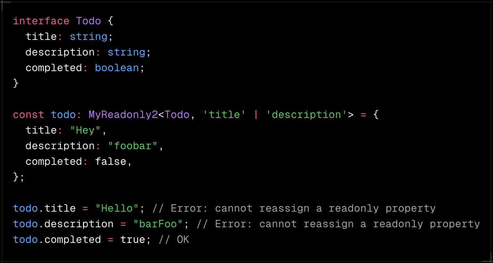

---

## Solution

- `Omit<Type, Keys>`
  - Creates a new type by excluding properties K from type T.
- `Pick<Type, Keys>`
  - Creates a new type by selecting only the properties K from type T.

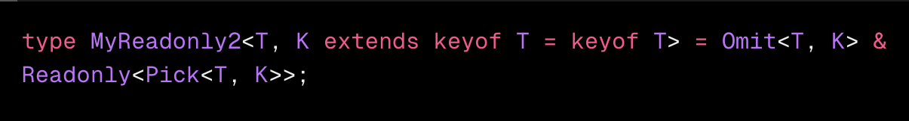

---

# Related Probelms - ②

<!--
_class: lead
 -->

---

Implement a generic `DeepReadonly<T>` which make every parameter of an object and its sub-objects recursively readonly.

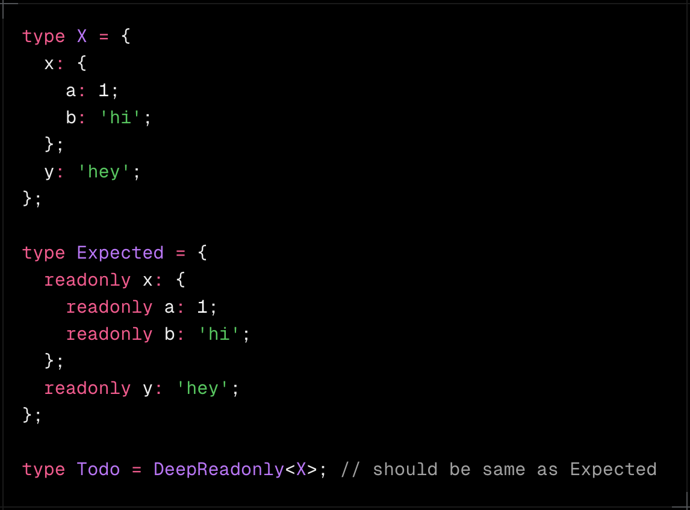

---

## Solution

- **If T is a primitive type**
  - it directly returns T with readonly
  - because primitive types don't have properties
- **If T is an object type, the type applies recursion**
  - It iterates over all properties of T using keyof T.

