### 2025/01/30

# TS Challenge - 3

### Keita Kawabata

<!--
_class: title
 -->

---

# Problem 1

### [Push](https://github.com/type-challenges/type-challenges/blob/main/questions/03057-easy-push/README.md)

<!--
_class: lead
 -->

---

## Problem 1

### Implement the generic version of `Array.push`

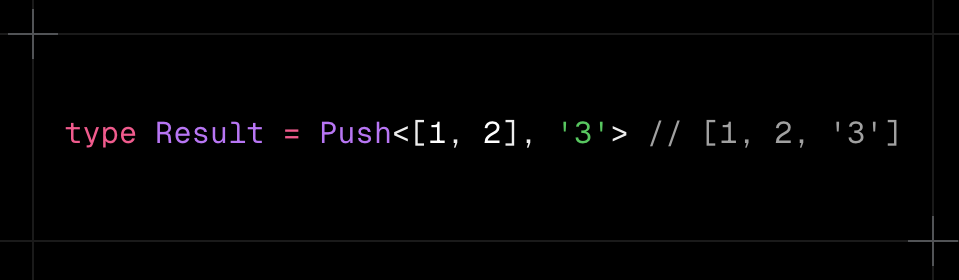

---

## Solution

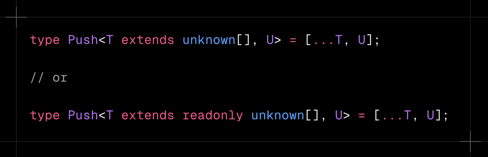

---

# Prerequisites

1. Generics
2. `any` / `unknown` type
3. Spread syntax

<!--
_class: prereq
 -->

---

# Prerequisites

1. Generics
2. `any` / `unknown` type
3. Spread syntax

<!--
_class: prereq
 -->

---

## Generics - Basic

#### A way to create reusable code that works with multiple types

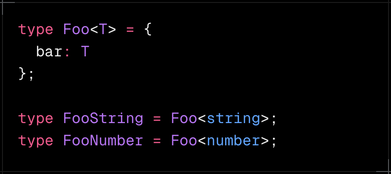

---

## Generics - Extends

#### Extends allows you to limit a generic type to a specific type

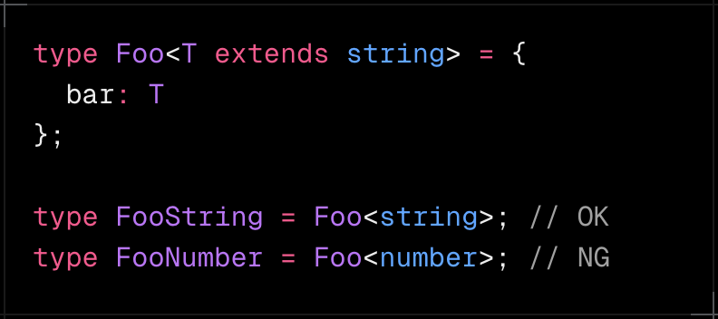

---

# Prerequisites

1. Generics
2. `any` / `unknown` type
3. Spread syntax

<!--
_class: prereq
 -->

---

## `any`

### Allow all types, any operation

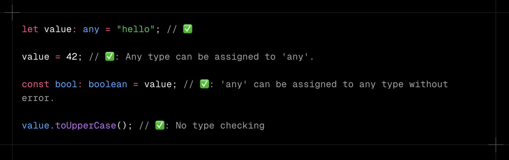

---

## `unknown`

### "Type-safe counterpart of any"

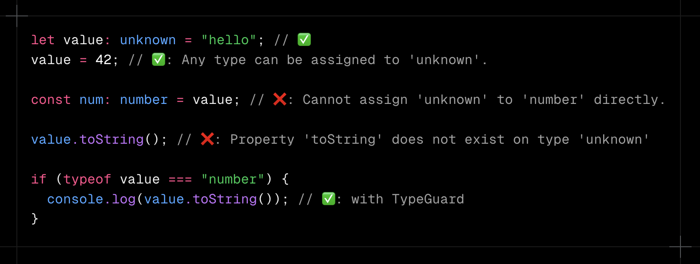

---

# Prerequisites

1. Generics
2. `any` / `unknown` type
3. Spread syntax

<!--
_class: prereq
 -->

---

## Spread syntax - Basic

#### A syntax that expands elements of arrays and objects

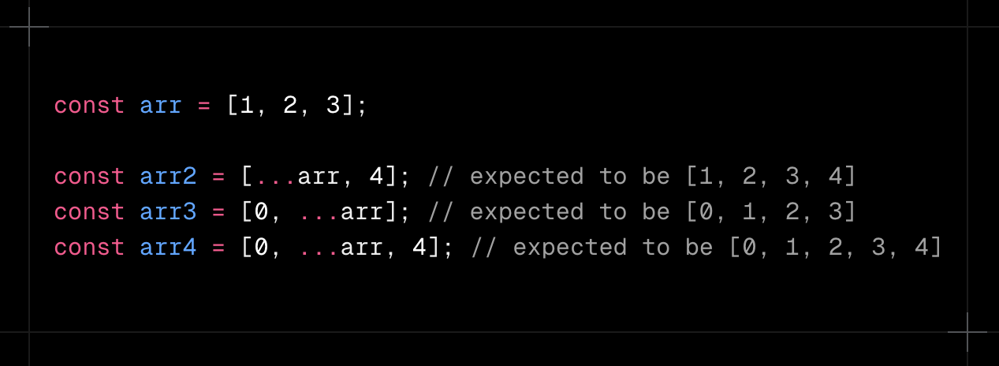

---

## Spread syntax - Type

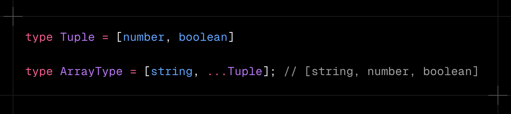

---

## Problem 1

### Implement the generic version of `Array.push`

---

## Solution

---

# Problem 2

### [Unshift](https://github.com/type-challenges/type-challenges/blob/main/questions/03060-easy-unshift/README.md)

<!--
_class: lead
 -->

---

## Problem 2

### Implement the type version of Array.unshift

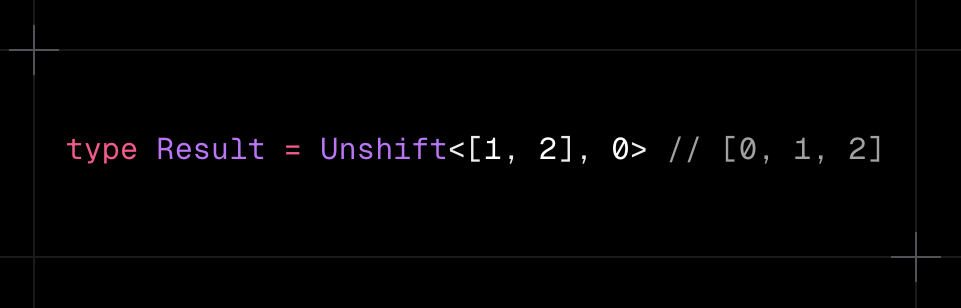

---

## Solution

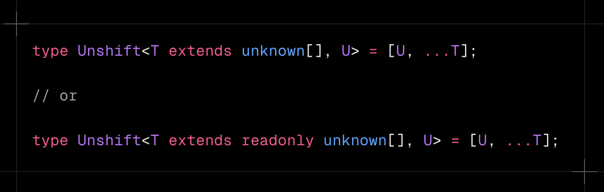

---

# Problem 3

### [Concat](https://github.com/type-challenges/type-challenges/blob/main/questions/00533-easy-concat/README.md)

<!--
_class: lead
 -->

---

## Problem 3

### Implement the JavaScript `Array.concat` function in the type system.

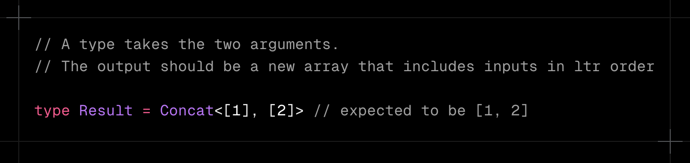

---

## Solution

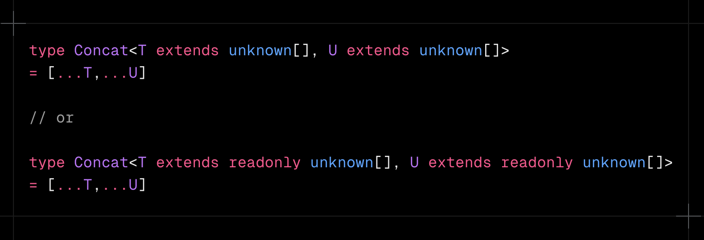

---

# Related Problem

### [Last of Array](https://github.com/type-challenges/type-challenges/blob/main/questions/00015-medium-last/README.md)

<!--
_class: lead
 -->

---

## Related Problem

### Implement a generic `Last<T>` that takes an Array T and returns its last element.

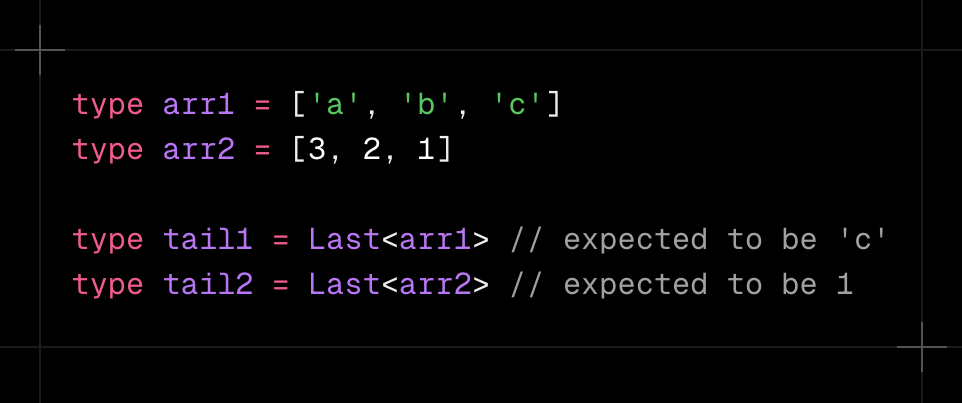

---

## Solution

- `[unknown, ...T]`
  - `T = [3, 2, 1]` becomes `[unknown, 3, 2, 1]`
- Without `[unknown, ...T]`
  - `[...T][T["length"]]` = `T[3]` is `undefined` (out of bounds.)

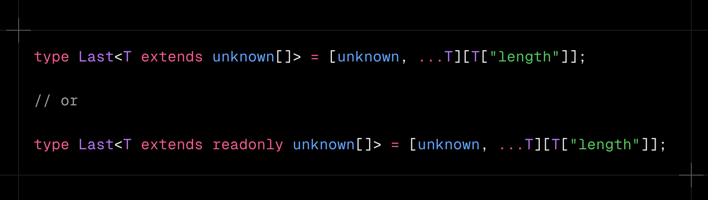
