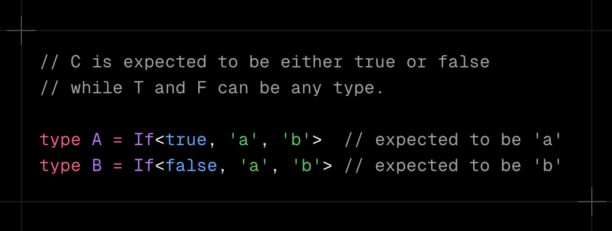
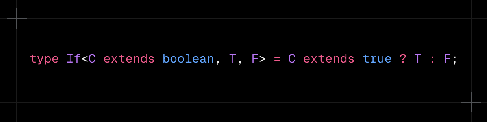
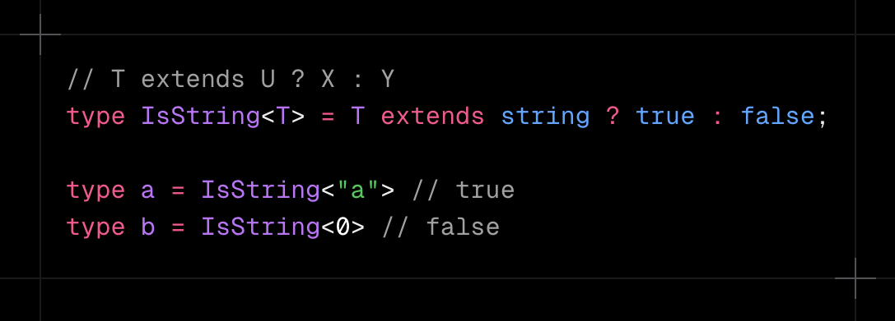
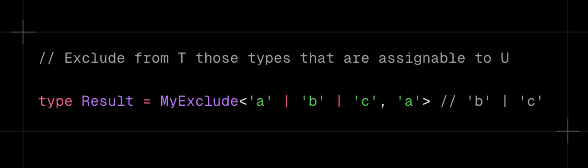
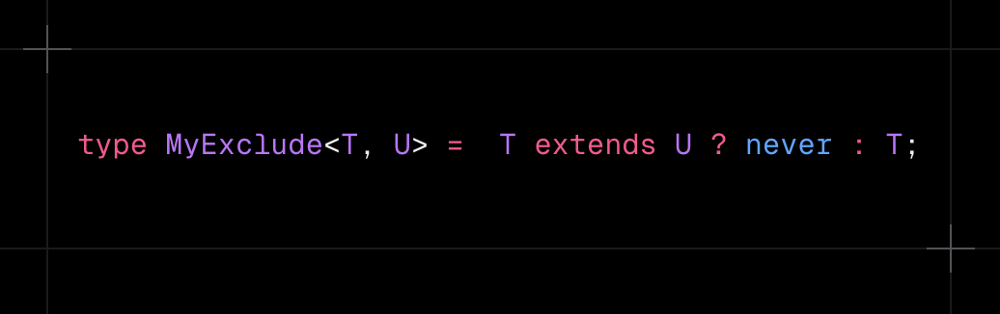
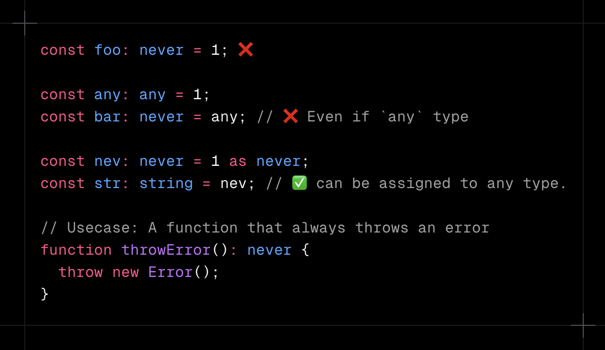
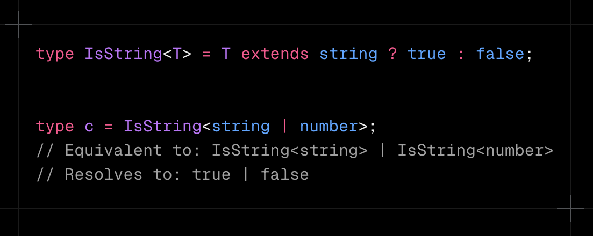
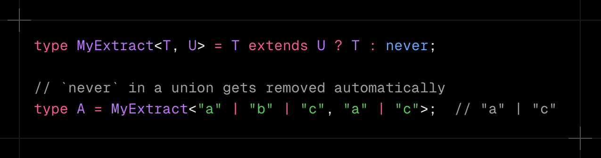

### 2025/02/06

# TS Challenge - 4

### Keita Kawabata

<!--
_class: title
 -->

---

# Problem 1

### - [If](https://github.com/type-challenges/type-challenges/blob/main/questions/00268-easy-if/README.md) -

<!--
_class: lead
 -->

---

## Problem 1

### Implement the util type `If<C, T, F>` which accepts condition `C`, a truthy value `T`, and a falsy value `F`.

---

## Solution

---

# Prerequisites

1. Generics
2. Conditional Type

<!--
_class: prereq
 -->

---

# Prerequisites

1. Generics
2. Conditional Type

<!--
_class: prereq
 -->

---

## Conditional Type - Basic

#### Allow you to define types dynamically based on conditions.

---

## Problem 1

### Implement the util type `If<C, T, F>` which accepts condition `C`, a truthy value `T`, and a falsy value `F`.

---

## Solution

---

# Problem 2

### - [Exclude](https://github.com/type-challenges/type-challenges/blob/main/questions/00043-easy-exclude/README.md) -

<!--
_class: lead
 -->

---

## Problem 2

### Implement the built-in `Exclude<T, U>`

---

## Solution

---

# Prerequisites

1. Generics
2. `never` type
3. Distributive Conditional Type

<!--
_class: prereq
 -->

---

# Prerequisites

1. Generics
2. `never` type
3. Distributive Conditional Type

<!--
_class: prereq
 -->

---

## `never` type

- `never` is an empty type — it represents nothing.

---

# Prerequisites

1. Generics
2. `never` type
3. Distributive Conditional Type

<!--
_class: prereq
 -->

---

## Distributive Conditional Type

#### `T extends U ? X : Y`

- if `T` is a union type, the condition is applied to each member of the union separately.

---

## Distributive Conditional Type

### - with `never` type

---

## Problem 2

### Implement the built-in `Exclude<T, U>`

---

## Solution

