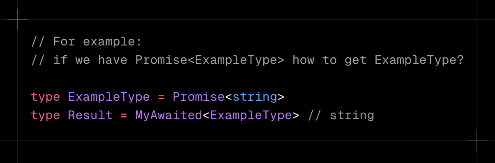
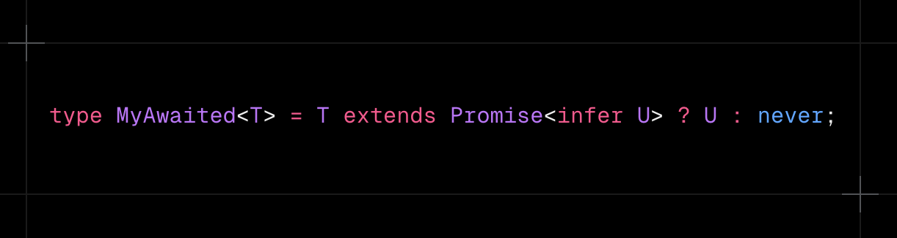
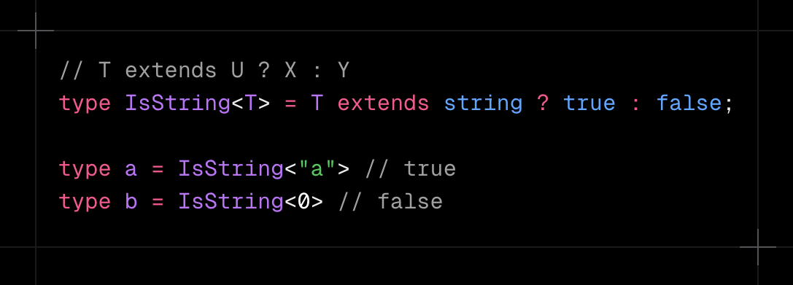
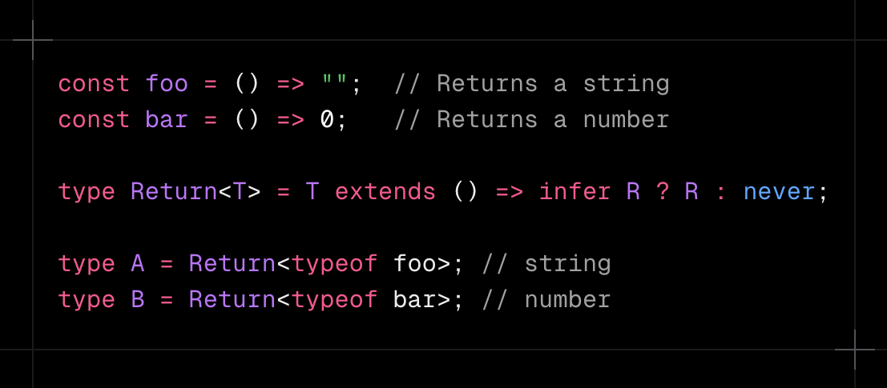
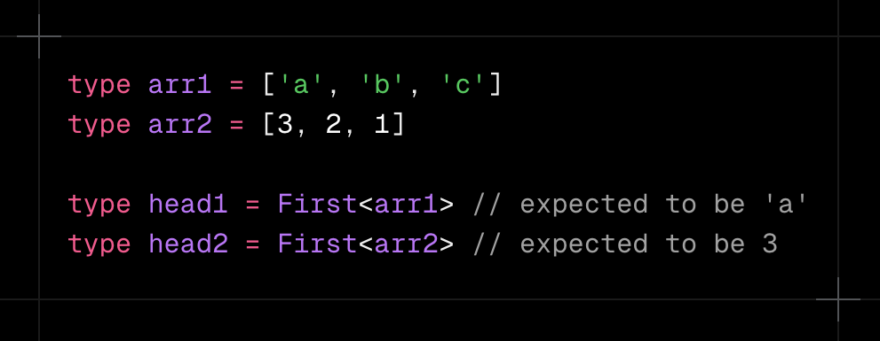
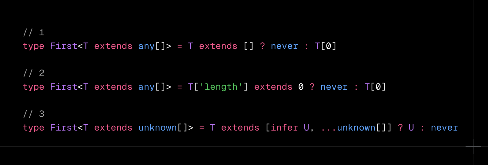
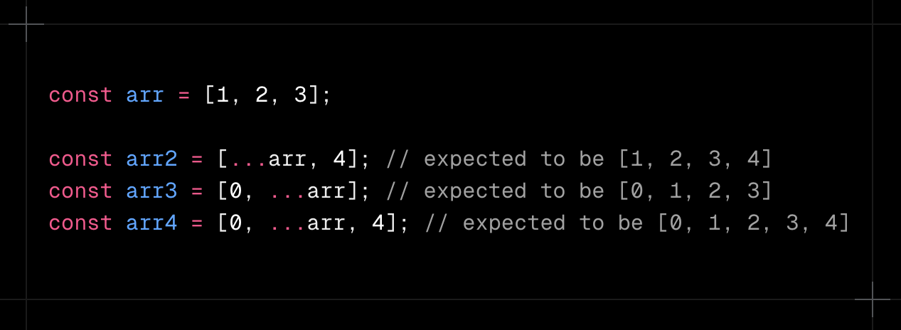
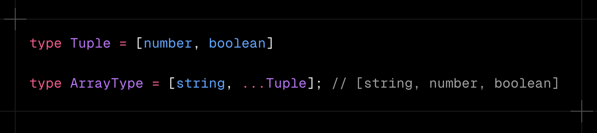
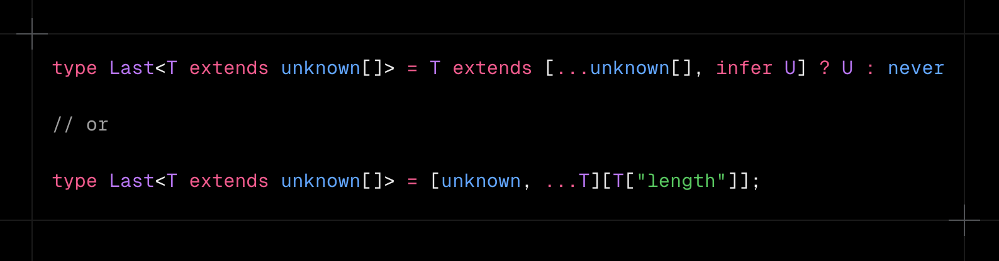

### 2025/02/11

# TS Challenge - 5

### Keita Kawabata

<!--
_class: title
 -->

---

# Problem 1

### - [Awaited](https://github.com/type-challenges/type-challenges/blob/main/questions/00189-easy-awaited/README.md) -

<!--
_class: lead
 -->

---

## Problem 1

### If we have a type which is a wrapped type like `Promise`, how can we get the type which is inside the wrapped type?

---

## Solution

---

# Prerequisites

1. Conditional Type
2. `infer`
<!--
_class: prereq
 -->

---

# Prerequisites

1. Conditional Type
2. `infer`

<!--
_class: prereq
 -->

---

## Conditional Type - Basic

#### Allow you to define types dynamically based on conditions.

---

# Prerequisites

1. Conditional Type
2. `infer`
<!--
_class: prereq
 -->

---

## `infer` - Basic

- `infer` is a type operator used in Conditional Types.
- It means "to infer" and can only be written on the right side of extends

---

## Problem 1

### If we have a type which is a wrapped type like `Promise`, how can we get the type which is inside the wrapped type?

---

## Solution

---

# Problem 2

### - [First of Array](https://github.com/type-challenges/type-challenges/blob/main/questions/00014-easy-first/README.md) -

<!--
_class: lead
 -->

---

## Problem 2

### Implement a generic `First<T>` that takes an Array T and returns its first element's type.

---

## Solution

---

# Prerequisites

1. Conditional Type
2. Spread Syntax
3. `infer`

<!--
_class: prereq
 -->

---

# Prerequisites

1. Conditional Type
2. Spread Syntax
3. `infer`

<!--
_class: prereq
 -->

---

## Spread Syntax - Basic

#### A syntax that expands elements of arrays and objects

---

## Spread Syntax - Type

---

## Problem 2

### Implement a generic `First<T>` that takes an Array T and returns its first element's type.

---

## Solution

---

# Related Problem

### - [Last of Array](https://github.com/type-challenges/type-challenges/blob/main/questions/00015-medium-last/README.md) -

<!--
_class: lead
 -->

---

## Related Problem

### Implement a generic `Last<T>` that takes an Array T and returns its last element.

---

## Solution

