### 2025/01/23

# TS Challenge - 2

### Keita Kawabata

<!--
_class: title
 -->

---

# Problem 1

### - [Length of Tuple](https://github.com/type-challenges/type-challenges/blob/main/questions/00018-easy-tuple-length/README.md) -

<!--
_class: lead
 -->

---

## Problem 1

### Create a generic `Length`, pick the length of the tuple

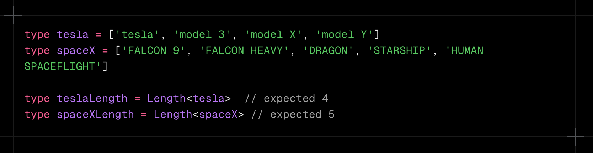

---

## Solution

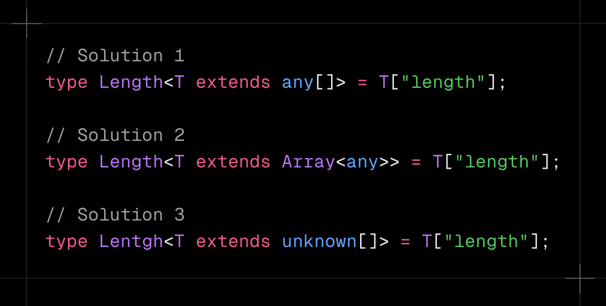

---

## Which is the prefer solution ?

---

## Best solution

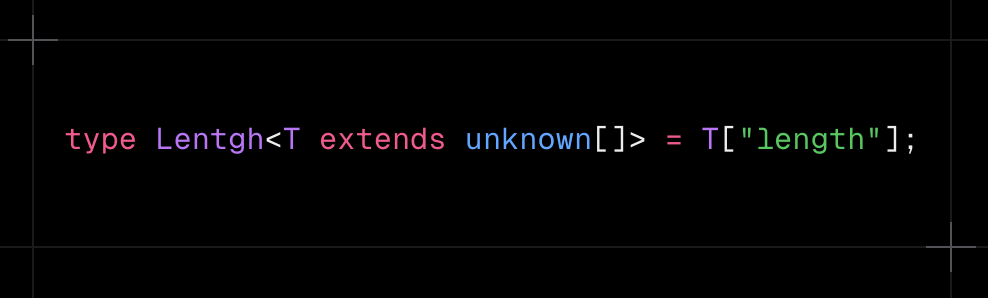

---

# Prerequisites

1. `any` / `unknown` type
2. Generics
3. index access types

<!--
_class: prereq
 -->

---

# Prerequisites

1. `any` / `unknown` type
2. Generics
3. index access types

<!--
_class: prereq
 -->

---

## `any`

### Allow all types, any operation

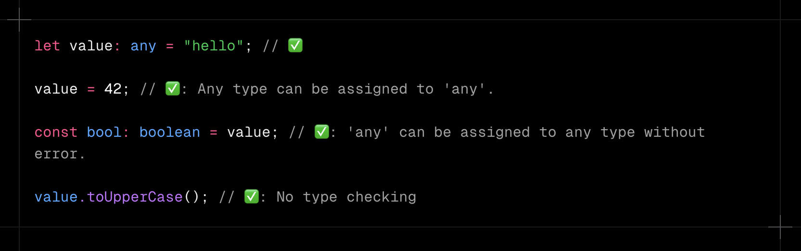

---

## `unknown`

### "Type-safe counterpart of any"

---

# Prerequisites

1. `any` / `unknown`
2. Generics
3. index access types

<!--
_class: prereq
 -->

---

## Generics - Basic

#### A way to create reusable code that works with multiple types

---

## Generics - Extends

#### Extends allows you to limit a generic type to a specific type

---

# Prerequisites

1. `any` / `unknown`
2. Generics
3. index access types

<!--
_class: prereq
 -->

---

## index access types

#### Can get the type of a specific key in object

---

### In Addition, it can access properties in TypeScript type definitions.

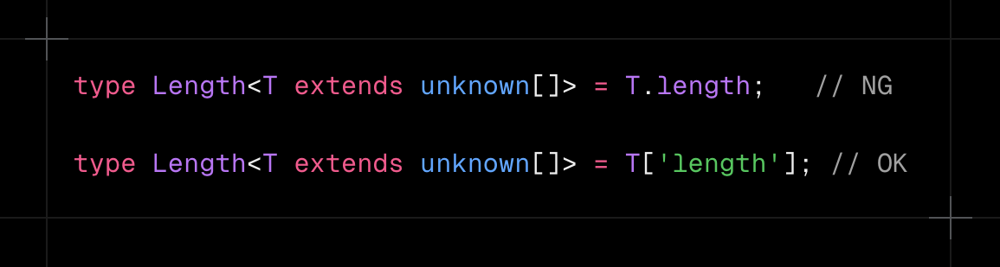

---

## Problem 1

### Create a generic `Length`, pick the length of the tuple

---

## Best solution

---

# Problem 2

### - [Tuple to Object](https://github.com/type-challenges/type-challenges/blob/main/questions/00011-easy-tuple-to-object/README.md) -

<!--
_class: lead
 -->

---

## Problem 2

### transform it into an object type and the key / value must be in the provided array.

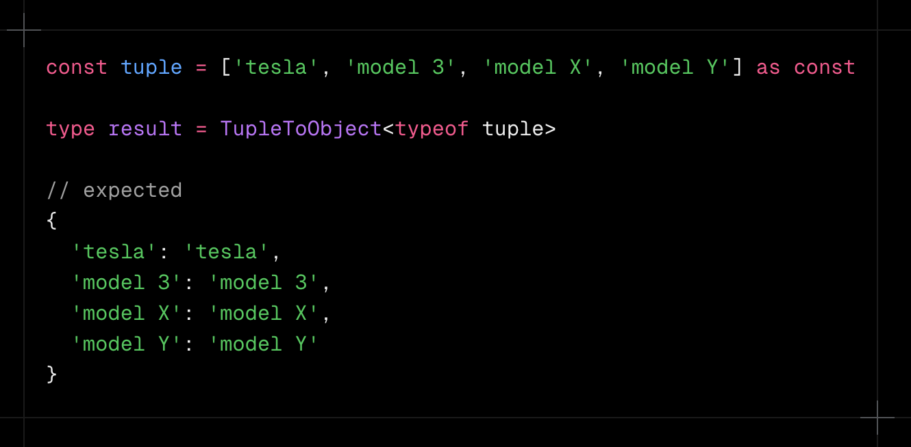

---

## Solution

### it works, but we should avoid using `any` type

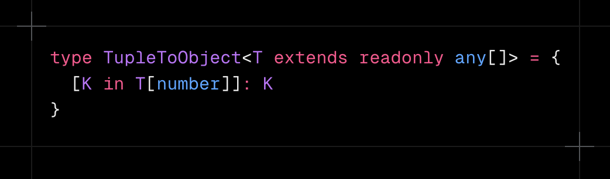

---

## Solution

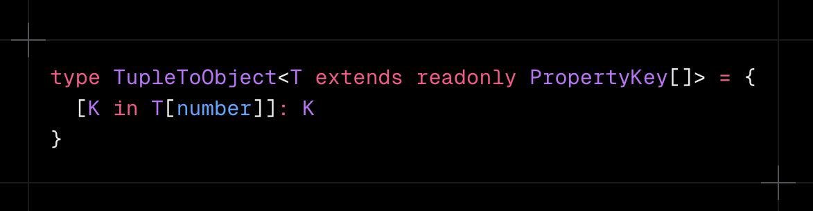

---

# Prerequisites

1. `as const` (const assertion)
2. `PropertyKey` type
3. Mapped Types
4. `T[number]` (Tuple)

<!--
_class: prereq
 -->

---

# Prerequisites

1. `as const` (const assertion)
2. `PropertyKey` type
3. Mapped Types
4. `T[number]` (Tuple)

<!--
_class: prereq
 -->

 

---

## `as const`

### Makes the variable readonly deeply with literal types

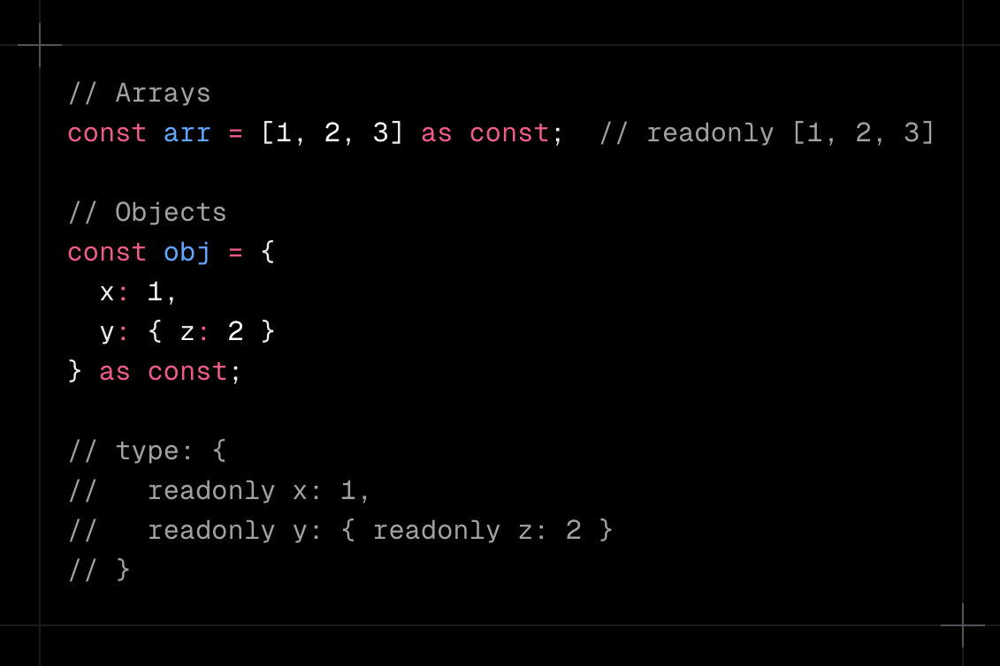

---

# Prerequisites

1. `as const` (const assertion)
2. `PropertyKey` type
3. Mapped Types
4. `T[number]` (Tuple)

<!--
_class: prereq
 -->

 

---

## `PropertyKey`

- `PropertyKey` is union type: `string | number | symbol`
  - In TypeScript, object can only have 3 types of values as keys: `string`, `number` and `symbol`

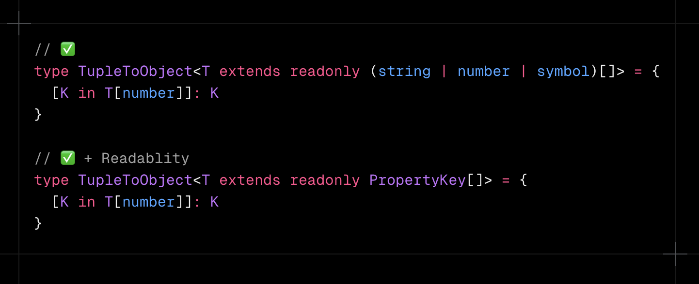

---

# Prerequisites

1. `as const` (const assertion)
2. `PropertyKey` type
3. Mapped Types
4. `T[number]` (Tuple)

<!--
_class: prereq
 -->

 

---

## Mapped Types

#### Can create a new object type based on a union of keys

---

# Prerequisites

1. `as const` (const assertion)
2. `PropertyKey` type
3. Mapped Types
4. `T[number]` (Tuple)

<!--
_class: prereq
 -->

 

---

## What it Tuple

- a special Array type
- Has a fixed length
- Has specific types for each elements

---

## `T[number]`

### allows you to extract the union of the types of all elements of the tuple

---

## `T[number]` with const assertion

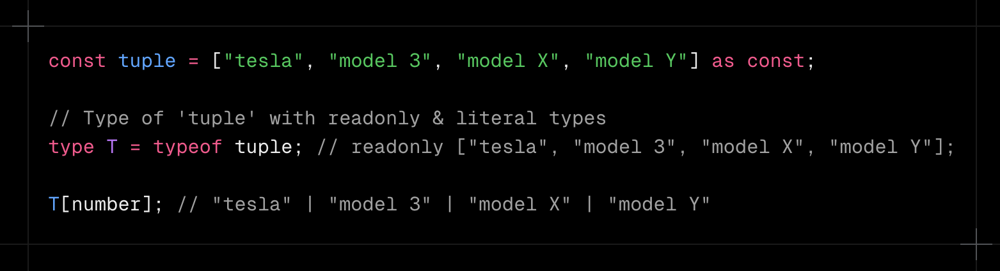

---

## Problem 2

### transform it into an object type and the key / value must be in the provided array.

---

## Best solution

---

# Related Problem

### - [Tuple to Union](https://github.com/type-challenges/type-challenges/blob/main/questions/00010-medium-tuple-to-union/README.md) -

<!--
_class: lead
 -->

---

## Related Problem

### Implement a generic TupleToUnion<T> which covers the values of a tuple to its values union.

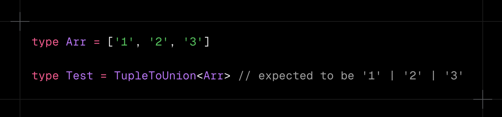

---

## Solution

- **`unknown` is the best choise in this case**
  - `unknown` permits any element types (e.g., `boolean`)
  - `PropertyKey` permits only `string | number | symbol` types

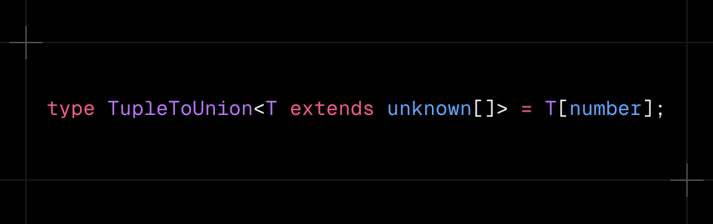
