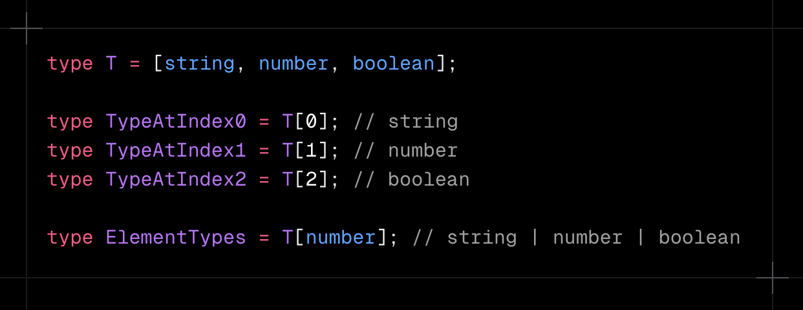

### 2025/02/19

# TS Challenge - 6

### Keita Kawabata

<!--
_class: title
 -->

---

# Problem 1

### - [Parameters](https://github.com/type-challenges/type-challenges/blob/main/questions/03312-easy-parameters/README.md) -

<!--
_class: lead
 -->

---

## Problem 1

### Implement the built-in Parameters generic without using it.

---

## Solution

---

# Prerequisites

1. Function Type
2. Conditional Type
3. `infer`
4. `any` & `unknown` type

<!--
_class: prereq
 -->

---

# Prerequisites

1. Function Type
2. Conditional Type
3. `infer`
4. `any` & `unknown` type

<!--
_class: prereq
 -->

---

## Function Type

---

#### with Spread Syntax

---

# Prerequisites

1. Function Type
2. Conditional Type
3. `infer`
4. `any` & `unknown` type

<!--
_class: prereq
 -->

---

## `infer`

- `infer` is a type operator used in Conditional Types.
- It means "to infer" and can only be written on the right side of extends

---

# Prerequisites

1. Function Type
2. Conditional Type
3. `infer`
4. `any` & `unknown` type

<!--
_class: prereq
 -->

---

## `any` & `unknown`

---

## `any` & `unknown`

- `infer U` works with `any[]`
  - elements have no restrictions
- `unknown[]` blocks inference
  - `unknown` is restrictive
  - TS avoids inference sometimes

---

## Problem 1

### Implement the built-in Parameters generic without using it.

---

## Solution

---

# Problem 2

### - [Includes](https://github.com/type-challenges/type-challenges/blob/main/questions/00898-easy-includes/README.md) -

<!--
_class: lead
 -->

---

## Problem 2

### Implement the JS `Array.includes` function in the type system. A type takes the two arguments. The output should be a boolean `true` or `false`.

---

## Solution - minimum

---

## Solution - best

---

# Prerequisites

1. Conditional Type
2. `T[number]`

<!--
_class: prereq
 -->

---

# Prerequisites

1. Conditional Type
2. `T[number]`

<!--
_class: prereq
 -->

---

## `T[number]`

### allows you to extract the union of the types of all elements of the tuple

---

# Dive into Best Solution

<!--
_class: lead
 -->

---

## Dive into Best Solution

- one example where unione one fails;

---

## Dive into Best Solution

---

## `IsEqual<X, Y>`

---

## `IsEqual<X, Y>`

#### this would allow partial matches :(

---

## `IsEqual<X, Y>`

#### this would not allow partial matches (※ No need to learn that much)

---

## `Includes<>`

#### `Includes` recursively until Rest runs out or U is found

---

## Problem 2

### Implement the JS `Array.includes` function in the type system. A type takes the two arguments. The output should be a boolean `true` or `false`.

---

## Solution - minimum

---

## Outro

- ### Thank you so much for your participation!

- ### Next:
  - #### Scheduled reading group:
    - [Software Engineering at Google](https://www.oreilly.com/library/view/software-engineering-at/9781492082781/)
  - #### Starting within the next month.
  - #### See you soon!

